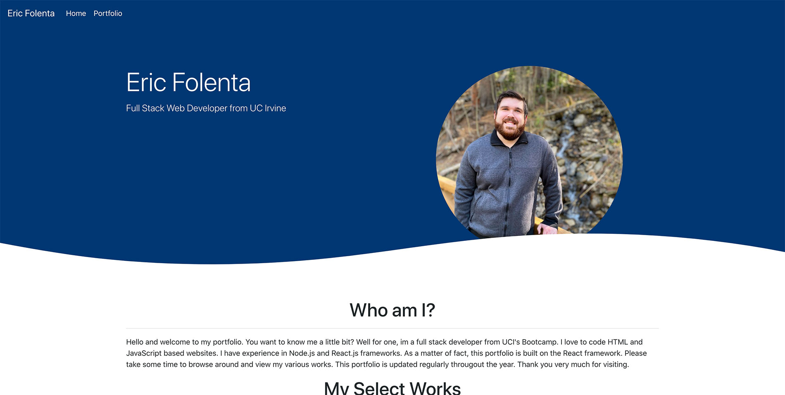
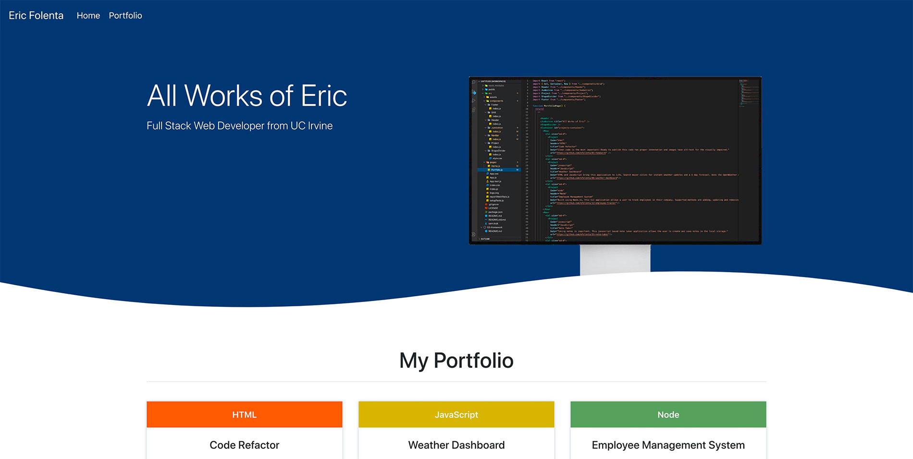
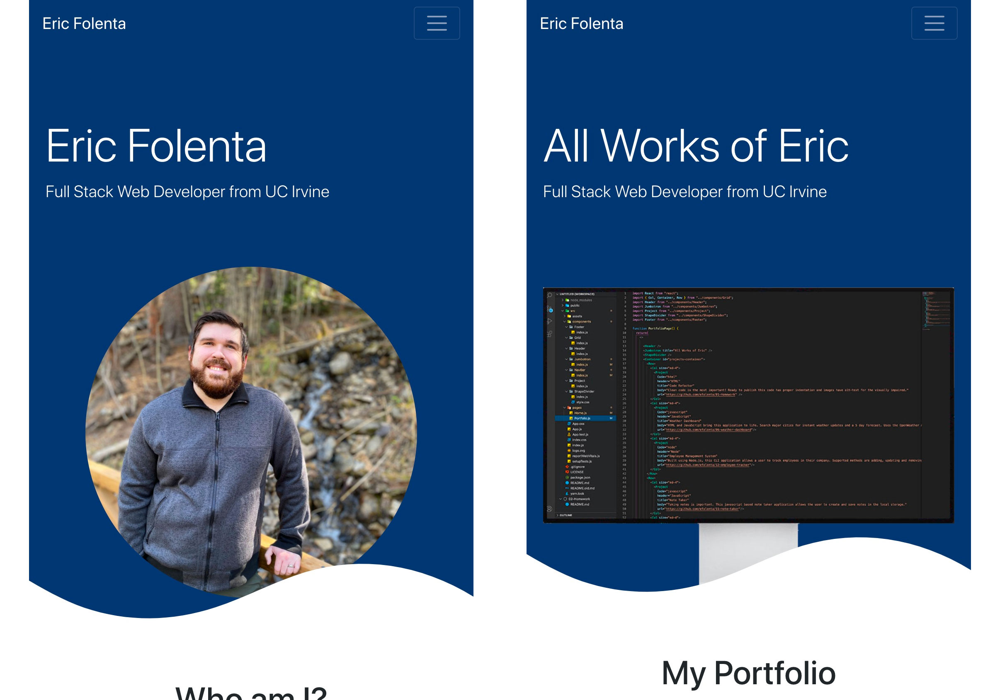

# React Portfolio

This portfolio was built using the React.js framework.

## Table of Contents

1. Deployed Link
2. Technologies Used
3. Screenshot

### Deployed Link

You can view the portfolio live right now! It's hosted on GitHub Pages thanks to the `gh-pages` node module.
Open [Live Portfolio](https://efolenta.github.io/portfolio/) to view it in the browser.

### Technologies Used

#### Frontend
- Bootstrap

#### Backend
- Node.js
- React

#### Dependencies
- react-router-dom (Used to create routes for multi-page navigation)
- gh-pages (Allows publishing on GitHub Pages)

### Screenshots

Homepage

